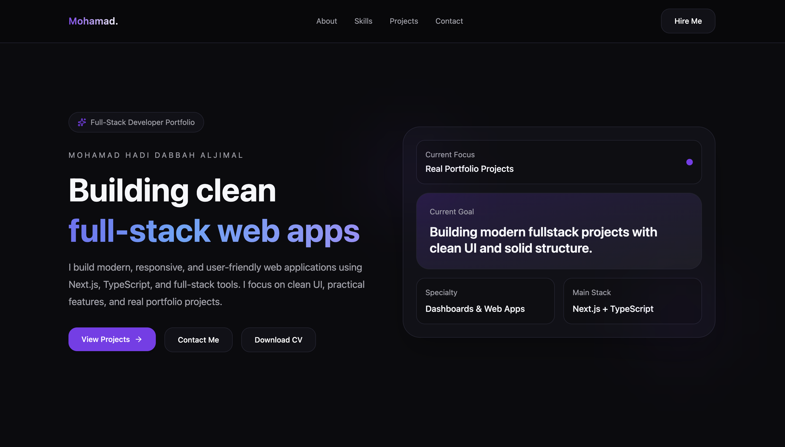
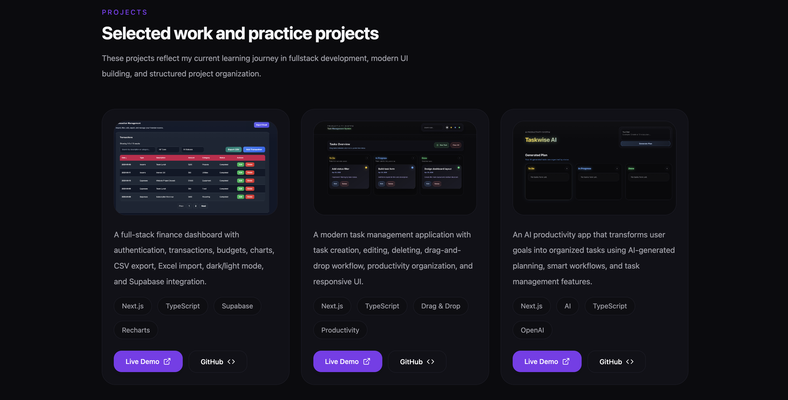
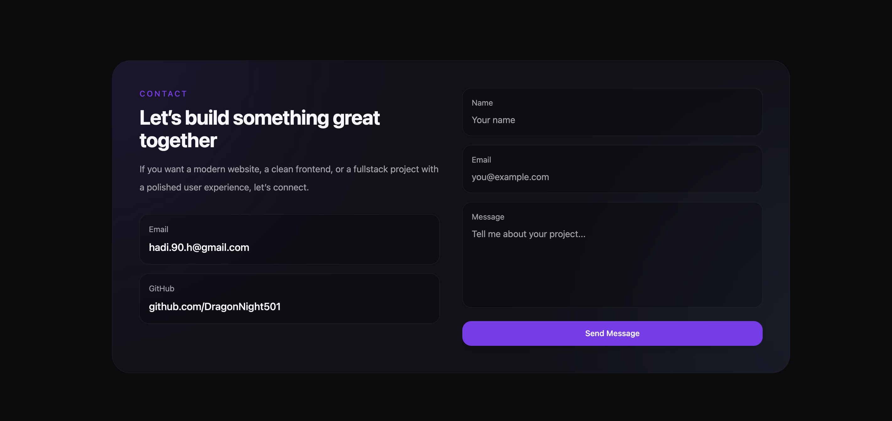

# ✨ Mohamad Hadi Portfolio

A modern full-stack developer portfolio built with Next.js, TypeScript, Tailwind CSS, and Framer Motion.

🌐 Live Website  
https://portfolio-mohamad-dabbah.vercel.app/

---

# 🚀 Features

- Modern responsive UI
- Smooth reveal animations
- Premium dark design system
- Interactive hover effects
- Project showcase section
- Contact form with email integration
- Mobile optimized layout
- Clean and reusable components
- GitHub & live demo links

---

# 🛠 Tech Stack

- Next.js
- TypeScript
- Tailwind CSS
- Framer Motion
- Resend
- Vercel

---

# 📸 Screenshots

## Hero Section



---

## Projects Section



---

## Contact Section



---

# 📂 Featured Projects

## 💰 FinTrack Dashboard

A modern finance dashboard with authentication, transactions, budgets, charts, CSV export, Excel import, dark/light mode, and Supabase integration.

### Tech Stack

- Next.js
- TypeScript
- Supabase
- Recharts

### Links

🔗 Live Demo  
https://mohamad-dashboard.vercel.app

💻 GitHub  
https://github.com/DragonNight501/dashboard-app

---

## ✅ Task Manager App

A productivity-focused task management application with drag-and-drop workflow, editing, deleting, responsive UI, and clean organization system.

### Tech Stack

- Next.js
- TypeScript
- Drag & Drop

### Links

🔗 Live Demo  
https://mohamad-dabbah-task.vercel.app

💻 GitHub  
https://github.com/DragonNight501/task-management-system

---

## 🤖 Taskwise AI

An AI-powered productivity application that transforms goals into organized tasks using AI-generated planning and smart workflows.

### Tech Stack

- Next.js
- OpenAI
- TypeScript

### Links

🔗 Live Demo  
https://mohamad-hadi-taskwise-ai.vercel.app

💻 GitHub  
https://github.com/DragonNight501/taskwise-ai

---

# ⚡ Getting Started

## Clone the repository

```bash
git clone https://github.com/DragonNight501/my-portfolio.git
```

## Install dependencies

```bash
npm install
```

## Run development server

```bash
npm run dev
```

---

# 📬 Contact

📧 Email  
hadi.90.h@gmail.com

💻 GitHub  
https://github.com/DragonNight501

---

# 🌍 Deployment

Deployed with Vercel.

---

# ⭐ Notes

This portfolio was designed and developed to showcase real-world full-stack projects, modern UI/UX practices, responsive layouts, animations, and clean architecture using modern web technologies.
