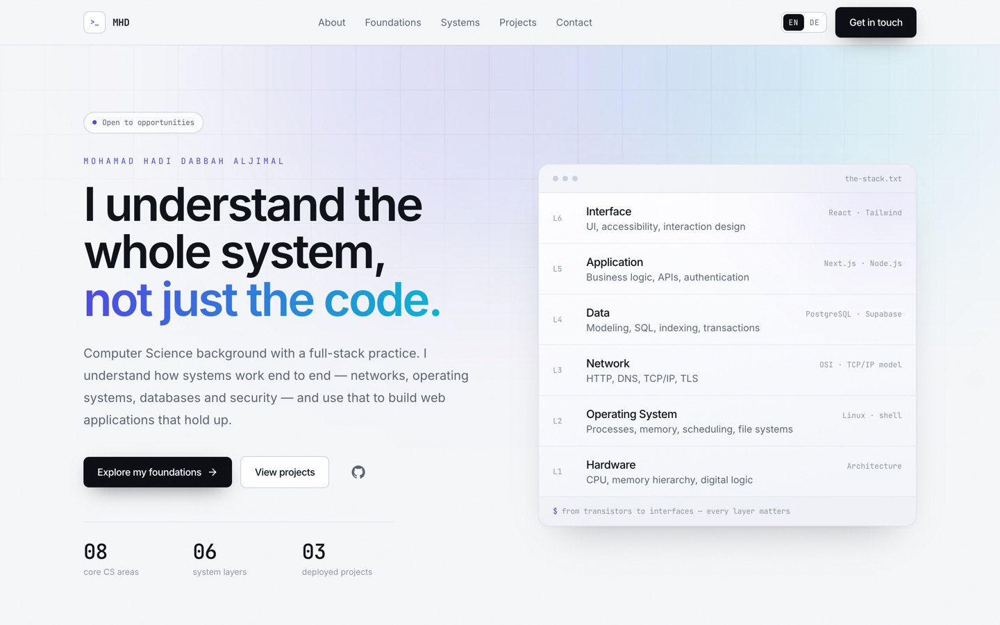
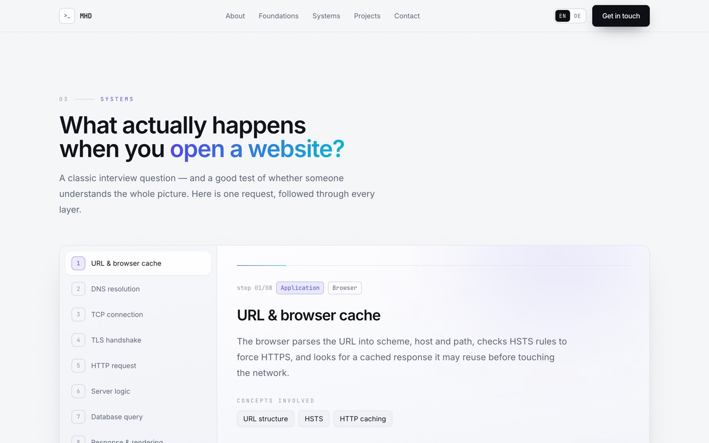
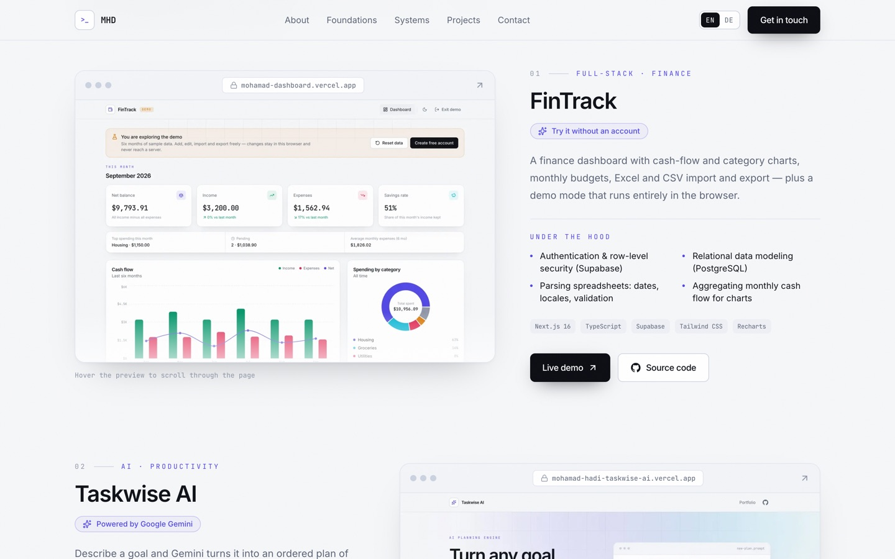

# Mohamad Hadi Dabbah Aljimal — Portfolio

A Computer Science background with a full-stack practice. This portfolio is built to show how systems work end to end — networks, operating systems, databases and security — and the projects that put those fundamentals to work.

**Live:** [English](https://portfolio-mohamad-dabbah.vercel.app/en) · [Deutsch](https://portfolio-mohamad-dabbah.vercel.app/de)

<p align="center">
  
</p>

## Highlights

- **Computer Science first** — a six-layer system diagram and eight foundation areas, from algorithms to IT security.
- **Interactive walkthrough** — *What actually happens when you open a website?* follows one request through DNS, TCP, TLS, HTTP, the server, the database and rendering. Keyboard-accessible tabs.
- **Project showcase** — each project sits in a browser frame with its real domain; hovering scrolls through a full-page screenshot of the live app.
- **Bilingual** — English and German at `/en` and `/de`, chosen from the browser language on first visit, switchable in the header, with `hreflang` alternates for search engines.
- **Contact form** — sends email through Resend, with HTML escaping, a rate limit, a honeypot and localized error messages.
- **SEO & sharing** — per-language metadata, generated Open Graph images, sitemap and robots.txt.
- **Accessibility** — skip link, visible focus states, and full support for reduced-motion settings.

<p align="center">
  
</p>

<p align="center">
  
</p>

## Featured projects

| Project | What it shows | Links |
| --- | --- | --- |
| **FinTrack** | Full-stack finance dashboard: Supabase auth with row-level security, monthly budgets, cash-flow charts, Excel/CSV import and export, demo mode | [Try the demo](https://mohamad-dashboard.vercel.app/demo) · [Code](https://github.com/DragonNight501/dashboard-app) |
| **Taskwise AI** | Goal → ordered task plan with Google Gemini, structured JSON output, rate limiting and a fallback | [Live](https://mohamad-hadi-taskwise-ai.vercel.app) · [Code](https://github.com/DragonNight501/taskwise-ai) |
| **Task Management System** | Kanban board with drag and drop, touch and keyboard controls, undo and local persistence | [Live](https://mohamad-dabbah-task.vercel.app) · [Code](https://github.com/DragonNight501/task-management-system) |

## Tech stack

- Next.js 16 (App Router, `proxy.ts` for locale routing) · React 19 · TypeScript
- Tailwind CSS v4 with a shared design system (also used by the three projects above)
- Framer Motion · lucide-react
- Resend for the contact form
- Deployed on Vercel

## Getting started

```bash
npm install
npm run dev
```

Open http://localhost:3000 — you are redirected to `/en` or `/de`.

For the contact form, create `.env.local`:

```bash
RESEND_API_KEY=your_resend_key
CONTACT_EMAIL=where-messages-should-go@example.com
```

## Project structure

```
src/
├── proxy.ts                        locale detection and redirects
├── app/
│   ├── [lang]/                     layout, page, OG image, error page
│   ├── api/contact/route.ts        validation, rate limit, email
│   ├── global-not-found.tsx        bilingual 404
│   └── sitemap.ts · robots.ts
├── components/
│   ├── layout/                     navbar, language switcher, footer
│   ├── sections/                   hero, about, foundations, request journey,
│   │                               projects, toolbox, contact
│   └── ui/                         buttons, project showcase, reveal, …
├── data/                           links, tags and screenshots (no copy)
└── i18n/dictionaries/              en.ts · de.ts — every visible string
```

### Editing content

All text lives in `src/i18n/dictionaries/en.ts` and `de.ts`. The German dictionary is typed against the English one, so a missing translation fails the build. Project links, tags and screenshots are in `src/data/projects.ts`; screenshots are in `public/projects/`.

## Author

**Mohamad Hadi Dabbah Aljimal** · [GitHub](https://github.com/DragonNight501)
